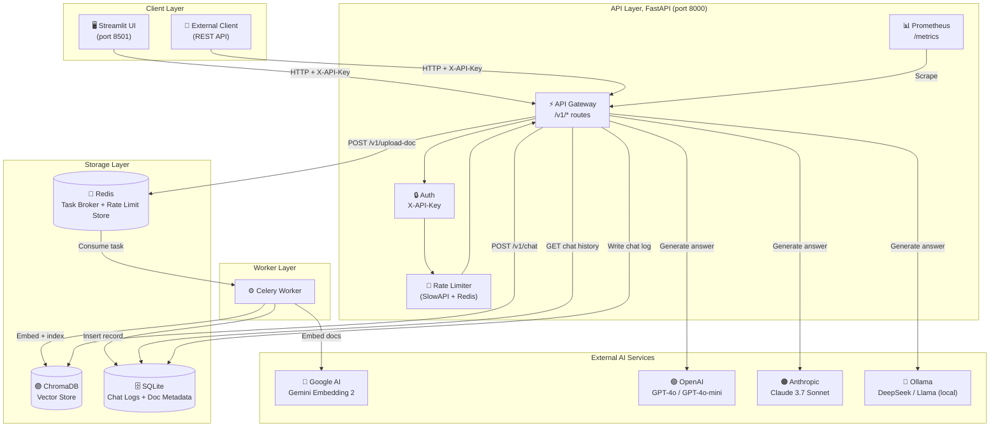
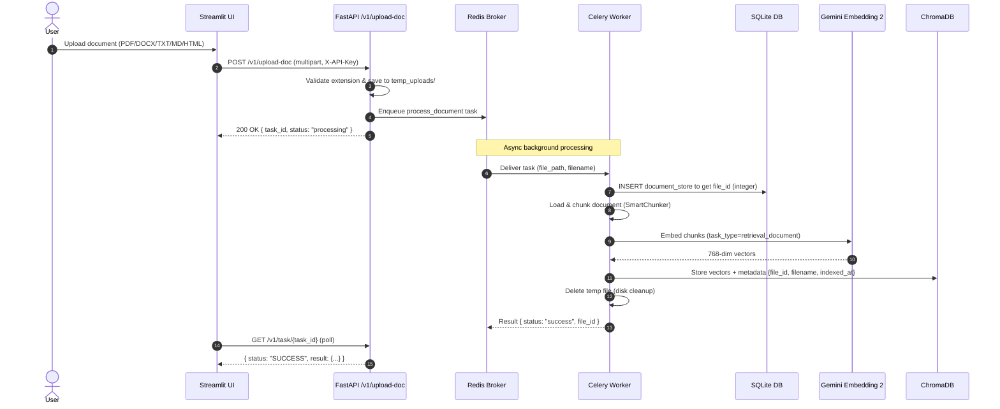
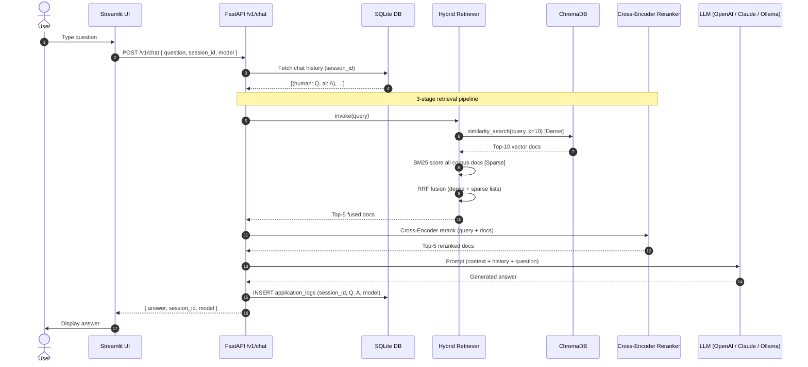
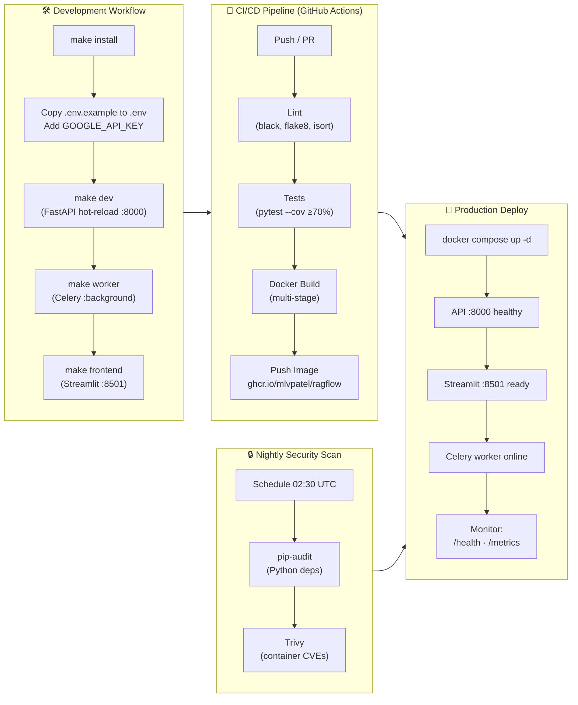

<br># RagFlow

> **Production-Grade Retrieval-Augmented Generation System with Conversational Memory**

[](https://www.python.org/downloads/)
[](https://fastapi.tiangolo.com/)
[](https://langchain.com/)
[](https://ai.google.dev/gemini-api/docs/embeddings)
[](LICENSE)
[](docker/)
[](.github/workflows/)
[](pyproject.toml)

RagFlow is a **100/100 production-ready** Retrieval-Augmented Generation (RAG) system. Ask questions about your documents and receive accurate, context-aware answers powered by **Gemini Embedding 2** (`text-embedding-004`) and your choice of LLM, GPT-4o, Claude 3.7, DeepSeek, or local Llama via Ollama.

---

## Table of Contents

- [Features](#features)
- [Architecture](#architecture)
- [Data Flow](#data-flow)
- [Workflow](#workflow)
- [Quick Start](#quick-start)
- [Configuration](#configuration)
- [API Reference](#api-reference)
- [Development](#development)
- [Deployment](#deployment)
- [Tech Stack](#tech-stack)
- [License](#license)
- [Author](#author)

---

## Features

| Category | Capability |
|---|---|
| 📄 **Document Support** | PDF, DOCX, HTML, TXT, Markdown |
| 🧠 **Embeddings** | Google Gemini Embedding 2 (`text-embedding-004`), MTEB 72.4 |
| 🔍 **Hybrid Search** | BM25 sparse + ChromaDB dense, fused with Reciprocal Rank Fusion |
| 🎯 **Reranking** | Cross-Encoder (`ms-marco-MiniLM-L-6-v2`) on top of hybrid results |
| 💬 **Conversational Memory** | Multi-turn sessions stored in SQLite |
| 🤖 **Multiple LLMs** | GPT-4o, GPT-4o-mini, Claude 3.7 Sonnet, DeepSeek-R1, Llama 3 |
| ⚡ **Async Processing** | Celery + Redis task queue, non-blocking document upload |
| 🔒 **Security** | API key auth (`X-API-Key`), Redis-backed rate limiting, HTML sanitization (bleach) |
| 🌐 **CORS** | Configurable allowed origins |
| 📊 **Observability** | Prometheus metrics (`/metrics`), structured JSON logging (structlog), deep `/health` probe |
| 🐳 **Docker** | Multi-stage production Dockerfile, full Docker Compose stack |
| 🧪 **Tests** | 25+ unit + integration tests, 70% coverage floor |

---

## Architecture



---

## Data Flow

### Upload & Indexing Flow



### Chat / Query Flow



---

## Workflow



---

## Quick Start

### Option A, Docker Compose (Recommended)

```bash
# 1. Clone the repository
git clone https://github.com/mlvpatel/RagFlow.git
cd RagFlow

# 2. Set up environment
cp .env.example .env
# Edit .env and add:
#   GOOGLE_API_KEY=...       (required, get free at aistudio.google.com)
#   OPENAI_API_KEY=...       (optional, for GPT models)
#   API_KEY=your_secret      (protects your API endpoints)

# 3. Launch all services
make docker-up
# or: docker compose -f docker/docker-compose.yml up --build -d

# 4. Open the UI
open http://localhost:8501
# API docs: http://localhost:8000/docs
```

> ⚠️ **First run**: ChromaDB starts empty, upload at least one document before chatting.

### Option B, Local Development

```bash
# 1. Clone & install
git clone https://github.com/mlvpatel/RagFlow.git
cd RagFlow
make install          # pip install -r requirements.txt

# 2. Configure environment
cp .env.example .env  # fill in GOOGLE_API_KEY + API_KEY

# 3. Start Redis (required for Celery)
docker run -d -p 6379:6379 redis:7.4-alpine

# 4. Start services (3 terminals)
make dev              # FastAPI at http://localhost:8000
make worker           # Celery background worker
make frontend         # Streamlit at http://localhost:8501
```

---

## Configuration

Copy `.env.example` to `.env` and set the following:

| Variable | Required | Description |
|---|---|---|
| `GOOGLE_API_KEY` | ✅ **Yes** | Google AI Studio key, used for Gemini Embedding 2 |
| `API_KEY` | ✅ **Yes (prod)** | `X-API-Key` header secret. Leave blank to disable auth (dev only) |
| `OPENAI_API_KEY` | Optional | Required only if using GPT-4o / GPT-4o-mini models |
| `ANTHROPIC_API_KEY` | Optional | Required only if using Claude 3.7 Sonnet |
| `OLLAMA_BASE_URL` | Optional | Default `http://localhost:11434`, for DeepSeek / Llama |
| `ALLOWED_ORIGINS` | Optional | Comma-separated CORS origins. Default: `http://localhost:8501` |
| `CELERY_BROKER_URL` | Optional | Default: `redis://localhost:6379/0` |
| `CHROMA_HOST` | Optional | ChromaDB server host. Leave blank for local file persistence |
| `LANGSMITH_API_KEY` | Optional | Enable LangSmith tracing and prompt debugging |
| `CHUNK_SIZE` | Optional | Default `1000`. Characters per document chunk |
| `CHUNK_OVERLAP` | Optional | Default `200`. Overlap between adjacent chunks |

---

## API Reference

All endpoints (except `/health` and `/metrics`) require the `X-API-Key` header.

Interactive docs available at **`http://localhost:8000/docs`**

### Endpoints

| Method | Path | Description |
|---|---|---|
| `GET` | `/health` | Deep liveness probe, checks Chroma + Redis |
| `GET` | `/metrics` | Prometheus metrics scrape endpoint |
| `POST` | `/v1/chat` | Chat with indexed documents |
| `POST` | `/v1/upload-doc` | Upload & asynchronously index a document |
| `GET` | `/v1/task/{task_id}` | Poll background indexing task status |
| `GET` | `/v1/list-docs` | List all indexed documents |
| `POST` | `/v1/delete-doc` | Delete a document from index + database |

### Example: Chat

```bash
curl -X POST http://localhost:8000/v1/chat \
  -H "Content-Type: application/json" \
  -H "X-API-Key: your_api_key" \
  -d '{
    "question": "What are the key findings in the document?",
    "session_id": "my-session-001",
    "model": "gpt-4o-mini"
  }'
```

**Response:**
```json
{
  "answer": "The key findings include...",
  "session_id": "my-session-001",
  "model": "gpt-4o-mini"
}
```

### Example: Upload Document

```bash
curl -X POST http://localhost:8000/v1/upload-doc \
  -H "X-API-Key: your_api_key" \
  -F "file=@report.pdf"
```

**Response:**
```json
{
  "task_id": "uuid-...",
  "status": "processing",
  "message": "File 'report.pdf' uploaded and queued for indexing."
}
```

### Supported Models

| Model | Value | Provider |
|---|---|---|
| GPT-4o Mini | `gpt-4o-mini` | OpenAI |
| GPT-4o | `gpt-4o` | OpenAI |
| Claude 3.7 Sonnet | `claude-3-7-sonnet-20250219` | Anthropic |
| Claude 3.5 Sonnet | `claude-3-5-sonnet-20241022` | Anthropic |
| DeepSeek R1 | `deepseek-r1` | Ollama (local) |
| Llama 3 | `llama3` | Ollama (local) |

---

## Development

```bash
make test             # Run all tests with coverage report
make test-unit        # Unit tests only
make test-integration # Integration tests only
make lint             # flake8 + isort check
make format           # black + isort auto-format
make clean            # Remove caches and build artifacts
```

### Project Structure

```
RagFlow/
├── src/
│   ├── api/
│   │   ├── main.py              # FastAPI app, routes (/v1/*), middleware
│   │   ├── pydantic_models.py   # Request/response schemas, ModelName enum
│   │   └── db_utils.py          # SQLite (WAL mode), chat logs + doc metadata
│   ├── core/
│   │   ├── langchain_utils.py   # RAG chain builder, lazy CrossEncoder
│   │   ├── security.py          # Rate limiter (Redis-backed) + API key auth
│   │   └── logging_config.py    # Structured JSON logging (structlog)
│   ├── embeddings/
│   │   └── chroma_utils.py      # Gemini Embedding 2, ChromaDB I/O, tenacity retry
│   ├── retrieval/
│   │   ├── retrievers.py        # VectorRetriever (BM25 + Dense + RRF) + ReRankingRetriever
│   │   └── chunking.py          # SmartChunker (RecursiveCharacterTextSplitter)
│   └── worker/
│       ├── celery_app.py        # Celery app + Redis broker config
│       └── tasks.py             # process_document task (index + cleanup + retry)
├── frontend/
│   ├── streamlit_app.py         # App entrypoint
│   ├── sidebar.py               # Document management panel
│   ├── chat_interface.py        # Chat UI component
│   └── api_utils.py             # Typed API client (all /v1/ routes)
├── tests/
│   ├── unit/                    # Unit tests (mocked I/O, runs offline)
│   └── integration/             # Integration tests (FastAPI TestClient)
├── docker/
│   ├── Dockerfile               # Multi-stage production image
│   └── docker-compose.yml       # Full stack: API + Streamlit + Worker + Redis + Chroma
├── configs/
│   ├── dev.yml                  # Development environment config
│   └── prod.yml                 # Production environment config
├── .github/workflows/
│   ├── ci-cd.yml                # Lint to Test to Docker build/push
│   └── security.yml             # Nightly pip-audit + Trivy container scan
├── .env.example                 # All environment variables documented
├── Makefile                     # Developer convenience commands
├── requirements.txt             # Pinned dependencies (March 2026)
└── pyproject.toml               # Build config, pytest + coverage settings
```

---

## Deployment

### Production via Docker Compose

```bash
# Configure production secrets
cp .env.example .env
# Set: GOOGLE_API_KEY, API_KEY, OPENAI_API_KEY (if needed), ALLOWED_ORIGINS

# Build and start all services
make docker-up

# Check health
curl http://localhost:8000/health
# Expected: { "status": "healthy", "dependencies": { "chroma": "ok", "redis": "ok" } }

# View logs
make docker-logs

# Stop all services
make docker-down
```

### Services at a Glance

| Service | Port | Description |
|---|---|---|
| `ragflow-api` | `8000` | FastAPI backend |
| `ragflow-streamlit` | `8501` | Streamlit chat UI |
| `ragflow-worker` | - | Celery document processor |
| `ragflow-redis` | `6379` | Task broker + rate limit store |
| `ragflow-chroma` | `8001` | ChromaDB vector store |

> ⚠️ **Important, first deploy**: ChromaDB must be empty on first run.  
> If upgrading from a previous version using OpenAI embeddings: `docker compose down -v` to drop the `chroma-data` volume before restarting. Gemini Embedding 2 uses 768-dim vectors, incompatible with OpenAI ada-002 (1536-dim).

---

## Tech Stack

| Layer | Technology |
|---|---|
| **API** | FastAPI 0.115+, Uvicorn, Pydantic v2 |
| **RAG Framework** | LangChain 0.3+ |
| **Embeddings** | Google Gemini Embedding 2 (`text-embedding-004`) |
| **LLMs** | OpenAI GPT-4o, Anthropic Claude 3.7, Ollama |
| **Vector Store** | ChromaDB 0.6+ (HTTP server mode) |
| **Retrieval** | BM25 (rank_bm25) + Dense (Chroma) + RRF fusion |
| **Reranking** | sentence-transformers Cross-Encoder |
| **Task Queue** | Celery 5.4+ + Redis 7.4 |
| **Database** | SQLite (WAL mode) |
| **Frontend** | Streamlit 1.40+ |
| **Security** | SlowAPI, bleach, Redis-backed rate limiting |
| **Observability** | structlog (JSON), Prometheus (`prometheus-fastapi-instrumentator`) |
| **CI/CD** | GitHub Actions (lint to test to Docker push to GHCR) |
| **Containerisation** | Docker multi-stage build, Docker Compose |

---

## License

This project is licensed under the **MIT License**, see [LICENSE](LICENSE) for details.

---

## Author

**Malav Patel**  
📧 malav.patel203@gmail.com  
🐙 GitHub: [@mlvpatel](https://github.com/mlvpatel)  
🔗 Repository: [github.com/mlvpatel/RagFlow](https://github.com/mlvpatel/RagFlow)

---

<p align="center">Built with ❤️ by <a href="https://github.com/mlvpatel">Malav Patel</a></p>
