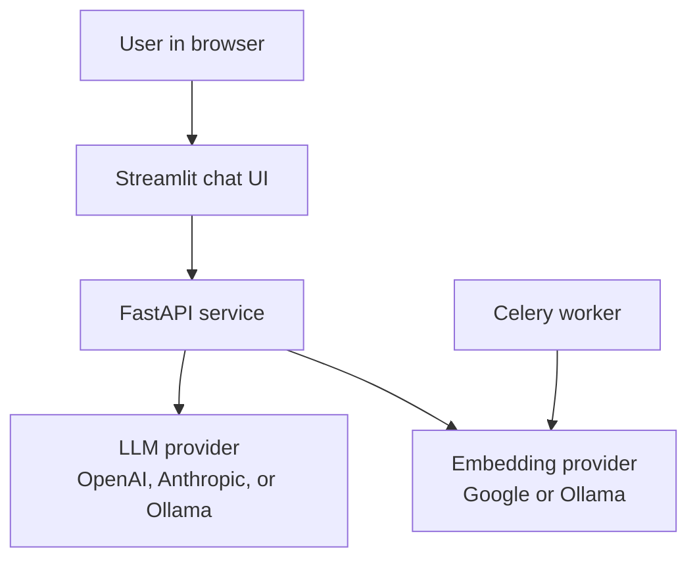
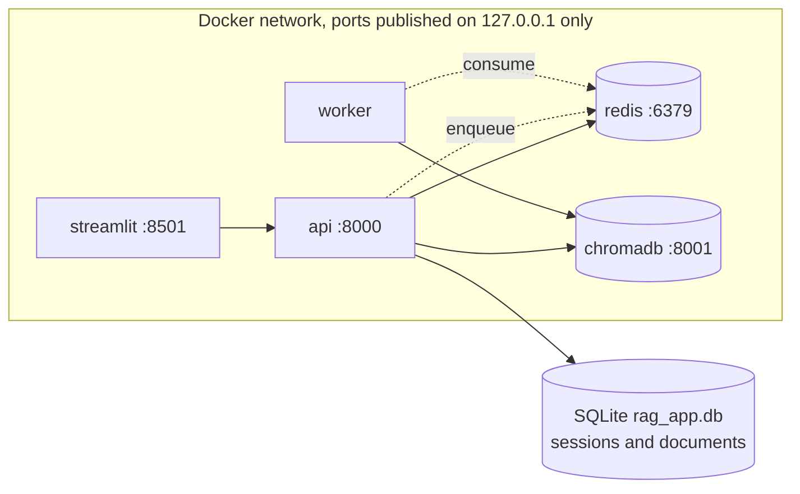
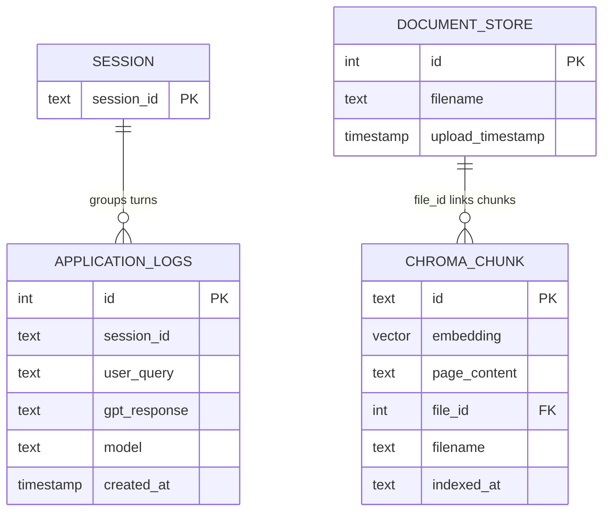
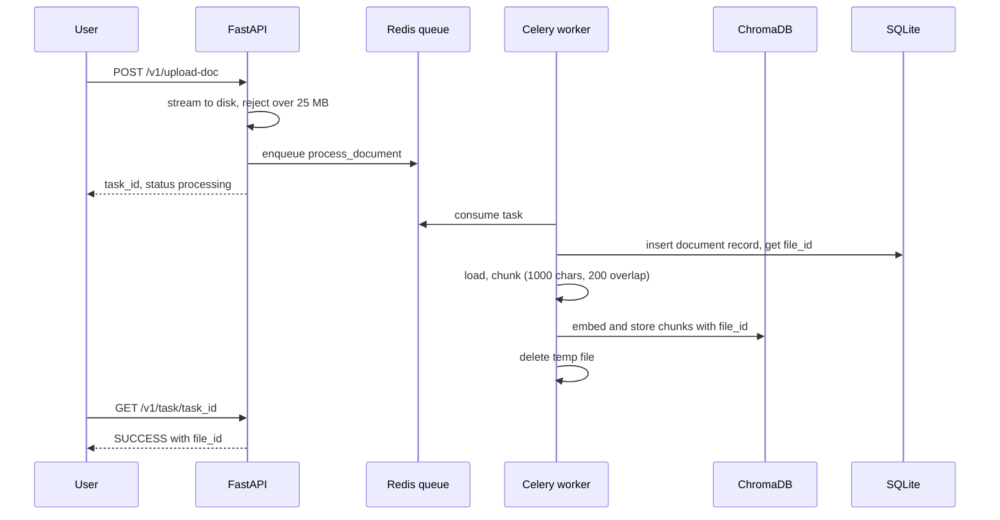
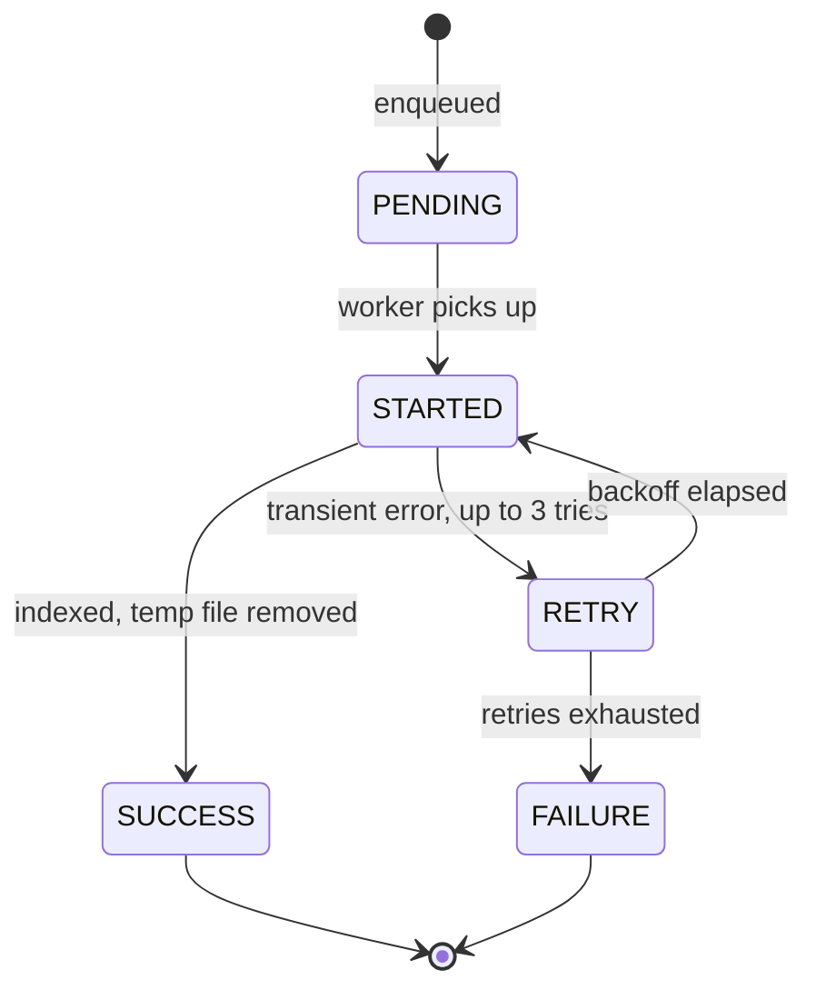
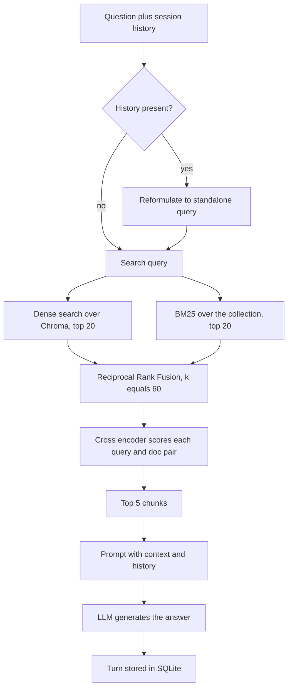
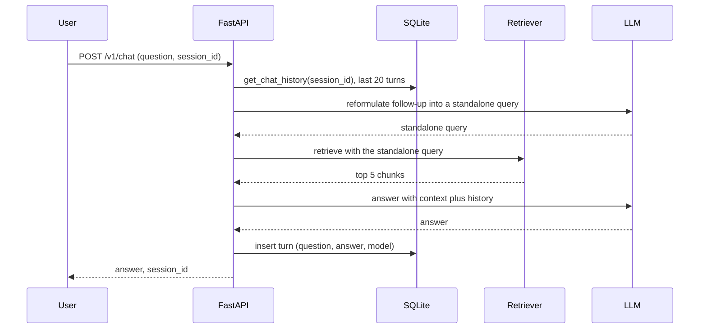

# rag-advanced-2023

**Advanced retrieval augmented generation for question answering over your own documents: hybrid dense plus BM25 retrieval fused with Reciprocal Rank Fusion, then a cross encoder reranker. The Advanced (2023) rung of the RAG line.**

Part of the RAG line, a series of reference enterprise RAG implementations, one per retrieval strategy. This repository is the Advanced (2023) rung. See [the full line](#the-rag-line) below.

[](https://github.com/mlvpatel/rag-advanced-2023/actions/workflows/ci-cd.yml)   


The clip above is a live, unedited run on a local llama3.2 model with the bundled sample data, including a real SEC 10-K, indexed in Chroma. No paid keys were used. Full recording at [assets/videos/rag-advanced-2023-demo.webm](assets/videos/rag-advanced-2023-demo.webm), screenshot at [assets/screenshots/rag-advanced-2023-ui.png](assets/screenshots/rag-advanced-2023-ui.png).

## Contents

- [What makes it advanced](#what-makes-it-advanced)
- [Tech stack](#tech-stack)
- [Architecture](#architecture)
- [Data model](#data-model)
- [How ingestion works](#how-ingestion-works)
- [How a question is answered](#how-a-question-is-answered)
- [Memory](#memory)
- [The mathematics](#the-mathematics)
- [How to use](#how-to-use)
- [Configuration](#configuration)
- [API reference](#api-reference)
- [A note on access](#a-note-on-access)
- [Testing](#testing)
- [Project structure](#project-structure)
- [The RAG line](#the-rag-line)

## What makes it advanced

The naive baseline embeds the question, runs one dense search, and hopes. That fails in a specific, predictable way: dense vectors are excellent at paraphrase ("vacation policy" finds "annual leave") and poor at exact tokens (an error code, a part number, a defined term in a 10-K). Keyword search fails in exactly the opposite way. This rung runs both and lets each cover the other's blind spot:

1. **Dense channel.** The question is embedded and searched against ChromaDB.
2. **Sparse channel.** A BM25 index scores the corpus on exact term overlap.
3. **Fusion.** The two ranked lists merge with Reciprocal Rank Fusion, which needs no score calibration between channels because it only uses ranks.
4. **Rerank.** A cross encoder reads the question and each candidate together and reorders by real relevance, keeping the top 5 of 10 candidates.

Conversational memory is applied before retrieval: a follow-up like "and how long does that take?" is first reformulated into a standalone question using the session history, so retrieval sees a complete query instead of a pronoun.

One honest limitation, accepted at this rung: the BM25 index is rebuilt from the collection on every query, which is O(corpus) per request. It keeps the implementation readable for the document sets this demo targets; the production shape (sparse ranking computed inside the database) is the next rung up, [rag-modular-2023](https://github.com/mlvpatel/rag-modular-2023).

## Tech stack

| Component | Choice | Why this one |
|---|---|---|
| API | FastAPI | Async, typed, OpenAPI for free |
| Vector store | ChromaDB 0.6 | Embedded for dev, HTTP server in Docker, no extra infra to learn at this rung |
| Sparse retrieval | rank_bm25 (BM25Okapi) | The reference BM25 implementation, pure Python, readable |
| Fusion | Reciprocal Rank Fusion | Rank based, so no cross channel score calibration needed |
| Reranker | cross-encoder/ms-marco-MiniLM-L-6-v2 | Small enough for CPU, trained specifically for passage reranking |
| Embeddings | Google text-embedding-004 or Ollama nomic-embed-text | Asymmetric task types on Google; Ollama for a fully local, keyless run |
| Generation | OpenAI, Anthropic, or Ollama | Routed by model name, one setting to switch |
| Memory | SQLite (WAL mode) | Concurrent readers with one writer, zero extra infra |
| Ingestion | Celery + Redis | Uploads return immediately, indexing happens in a worker |
| UI | Streamlit | A chat surface in one file |
| Observability | structlog + Prometheus | Per request trace ids, /metrics endpoint |
| CI | GitHub Actions | Lint, tests with a 70 percent coverage gate, nightly pip-audit |

## Architecture

System context: who talks to what.



Containers: the five services docker compose runs and how they connect.



## Data model

Two stores, each doing one job: SQLite for sessions and the document registry, Chroma for vectors.



`file_id` is stamped into every chunk's metadata at index time, which is what makes deletion exact: removing a document deletes precisely its chunks and nothing else.

## How ingestion works

Uploads return immediately with a task id; the worker does the heavy lifting.



The record is inserted before indexing on purpose: the chunks need a real `file_id` in their metadata, and a failed run then has a record to roll back rather than orphaned vectors.

Task lifecycle:



## How a question is answered



The funnel narrows on purpose: 10 fused candidates reach the cross encoder, which keeps 5. A reranker that receives exactly as many candidates as it returns can only reorder, never rescue, so the base retriever always over-fetches.

## Memory

Sessions are multi user by design: every turn is stored under a `session_id`, and history is windowed to the last 20 turns so a long session does not grow the prompt without bound.



The reformulation step is what makes "and how long does that take?" work: retrieval never sees a pronoun, it sees the full question the pronoun stood for.

## The mathematics

**Dense similarity.** A chunk and a query become vectors, and closeness is cosine similarity:

$$\text{sim}(\mathbf{q}, \mathbf{d}) = \frac{\mathbf{q} \cdot \mathbf{d}}{\lVert \mathbf{q} \rVert \, \lVert \mathbf{d} \rVert}$$

Chroma orders candidates by this and returns the top 20 for fusion.

**Why the embeddings are asymmetric.** A question and the passage that answers it are not paraphrases of each other. The Google embedder therefore takes a task type, giving two different maps: $f_D$ with `retrieval_document` at index time and $f_Q$ with `retrieval_query` at query time, trained so that $\text{sim}(f_Q(q), f_D(d))$ is high when $d$ answers $q$, not merely when the two texts look alike.

**BM25 (Okapi).** The sparse channel scores a document $d$ for query $q$ by exact term overlap, with two corrections that plain term counting misses:

$$\text{BM25}(q, d) = \sum_{t \in q} \text{IDF}(t) \cdot \frac{f(t, d)\,(k_1 + 1)}{f(t, d) + k_1\left(1 - b + b\,\frac{|d|}{\text{avgdl}}\right)}$$

where $f(t,d)$ is the term frequency in $d$, $|d|$ the document length, and avgdl the average document length. The library defaults used here are $k_1 = 1.5$, which saturates term frequency (the tenth occurrence of a word adds far less than the second), and $b = 0.75$, which normalizes for length (long documents must not win just by containing more words). IDF weights rare terms up, and rank_bm25 floors negative IDF at $\varepsilon = 0.25$ times the average IDF so very common terms cannot subtract relevance.

**Reciprocal Rank Fusion.** Each channel produces a ranked list; a document at 0-based rank $r$ in a list contributes

$$\text{RRF}(d) = \sum_{\text{lists}} \frac{1}{k + r + 1}, \qquad k = 60$$

The constant damps the top of each list: rank 0 scores $\tfrac{1}{61}$ and rank 1 scores $\tfrac{1}{62}$, so one channel's strong opinion cannot drown out the other. A document ranked second by both channels scores $\tfrac{1}{62} + \tfrac{1}{62}$, which beats a document ranked first by only one at $\tfrac{1}{61}$. Agreement wins, and that is the entire point of running two channels. Because only ranks enter the formula, BM25 scores and cosine similarities never need to be calibrated against each other.

**Bi encoder versus cross encoder.** The dense channel is a bi encoder: query and document are embedded independently and compared afterwards, which is what makes searching a whole corpus cheap. The reranker is a cross encoder: it reads the concatenated pair and outputs one relevance score

$$s(q, d) = g([q \, ; \, d])$$

with full token level attention between question and passage. That is far more accurate and far too slow to run over a corpus, so it runs only over the 10 fused candidates and keeps the top 5. The funnel exists because each stage buys accuracy with the compute the previous stage saved.

**Chunking.** With chunk size $c = 1000$ characters and overlap $o = 200$, a document of length $L$ yields approximately

$$n \approx \left\lceil \frac{L - o}{c - o} \right\rceil$$

chunks. The overlap exists so a sentence that straddles a boundary appears whole in at least one chunk.

## How to use

### Docker Compose (full stack)

```bash
cp .env.example .env
# set GOOGLE_API_KEY for embeddings, plus an LLM key, or configure Ollama
docker compose -f docker/docker-compose.yml up --build -d
open http://localhost:8501      # the chat UI
# API docs at http://localhost:8000/docs
```

Then in the UI: upload a document in the sidebar, wait for it to index, and ask a question. Follow up questions use the earlier conversation.

### Local, fully offline with Ollama (no paid keys)

```bash
# 1. Start Ollama and pull the models
ollama serve &
ollama pull nomic-embed-text
ollama pull llama3.2:3b

# 2. Install and run
make install
docker run -d -p 127.0.0.1:6379:6379 redis:7-alpine   # Redis for the worker
EMBEDDING_PROVIDER=ollama make dev      # API at :8000
make worker                             # second terminal
make frontend                           # third terminal, UI at :8501
```

### Try it with the bundled sample data

The repo ships three sample documents in [sample_data](sample_data), an HR handbook, a product FAQ, and a real SEC 10-K excerpt, so you can judge retrieval quality without supplying your own files:

```bash
EMBEDDING_PROVIDER=ollama python scripts/load_sample_data.py
```

Then ask the questions in [sample_data/README.md](sample_data/README.md), including an honesty check where the model should decline rather than guess. The 10-K questions are where hybrid retrieval visibly beats the naive baseline: exact figures and defined terms are keyword problems.

## Configuration

Settings come from environment variables, see `.env.example`.

| Variable | Default | Meaning |
|---|---|---|
| EMBEDDING_PROVIDER | google | google or ollama |
| GOOGLE_API_KEY | none | Required for the google provider |
| OPENAI_API_KEY / ANTHROPIC_API_KEY | none | For GPT or Claude models |
| OLLAMA_BASE_URL | http://localhost:11434 | Local models |
| CHUNK_SIZE / CHUNK_OVERLAP | 1000 / 200 | Chunking parameters |
| CHROMA_HOST / CHROMA_PORT | unset / 8000 | Set for a Chroma server; unset uses local persistence |
| ALLOWED_ORIGINS | http://localhost:8501 | CORS allowlist |
| MAX_UPLOAD_MB | 25 | Uploads rejected above this size |
| CELERY_BROKER_URL | redis://localhost:6379/0 | Queue and rate limit store |

## API reference

| Method and path | Purpose | Limit |
|---|---|---|
| GET /health | Deep liveness, probes Chroma and Redis | none |
| GET /metrics | Prometheus metrics | none |
| POST /v1/chat | Hybrid RAG answer with session memory | 60/min |
| POST /v1/upload-doc | Upload, queue async indexing | 10/min, 25 MB |
| GET /v1/task/{task_id} | Poll indexing status | none |
| GET /v1/list-docs | List indexed documents | none |
| POST /v1/delete-doc | Delete a document and its chunks | none |

## A note on access

The service has no authentication, and that is a decision rather than an omission. It is a reference implementation meant to run on one machine: docker compose binds every published port to `127.0.0.1`, and the containers run as a non-root user. A shipped default credential would be the worse option, since it reads as protection while sitting in a public repository. What remains is real: per route rate limiting backed by Redis, a hard size cap on uploads, HTML stripping on every question, and a narrow CORS origin. Put an authenticating gateway in front before exposing any of it beyond loopback.

## Testing

```bash
make test        # full suite with coverage, CI enforces 70 percent
```

The suite covers the RRF math (including that agreement between channels outranks a single channel's top hit), the hybrid path with a keyword-only match that dense search misses, the reranker funnel width, the history window, ingestion ordering and temp file cleanup, the upload cap, and rate limiting. Tests mock all external IO; CI runs them against a real Redis service container.

## Project structure

```
src/api/           FastAPI app, endpoints, SQLite session memory
src/core/          RAG chain, LLM routing, rate limiting, logging
src/embeddings/    Chroma vector store, embedding providers, chunking
src/retrieval/     hybrid retriever, RRF, cross encoder reranker
src/worker/        Celery app and the async indexing task
frontend/          Streamlit chat UI
sample_data/       runnable sample documents
scripts/           sample data loader
tests/             unit and integration tests
docker/            Dockerfile and the five service Compose stack
```

## The RAG line

This repo is the Advanced (2023) rung. Each rung adds one idea and keeps the ones below it.

| Year | Repository | Strategy |
|---|---|---|
| 2022 | [rag-naive-2022](https://github.com/mlvpatel/rag-naive-2022) | Naive: one dense search over Chroma |
| 2023 | rag-advanced-2023, this repo | Advanced: hybrid, RRF and cross encoder, in Python |
| 2023 | [rag-modular-2023](https://github.com/mlvpatel/rag-modular-2023) | Modular: pgvector, RRF in SQL, streaming, memory, evaluation |
| 2024 | [rag-graph-2024](https://github.com/mlvpatel/rag-graph-2024) | Graph: entity and triple knowledge graph linked into answers |
| 2024 | [rag-cache-2024](https://github.com/mlvpatel/rag-cache-2024) | Cache: no retrieval, corpus in context with a semantic cache |
| 2025 | [rag-agentic-2025](https://github.com/mlvpatel/rag-agentic-2025) | Agentic: bounded self correcting loop, confidence gated |
| 2026 | [rag-multiagent-2026](https://github.com/mlvpatel/rag-multiagent-2026) | Multi agent: supervisor, specialists, verifier |
| 2026 | [rag-multimodal-2026](https://github.com/mlvpatel/rag-multimodal-2026) | Multimodal: text and images in one vector space |

The next implementation up, [rag-modular-2023](https://github.com/mlvpatel/rag-modular-2023), replaces ChromaDB with pgvector on Postgres, moves memory to Postgres, computes hybrid retrieval in a single SQL query, streams answers, and adds a measurable evaluation harness.

## Author

Malav Patel. GitHub [@mlvpatel](https://github.com/mlvpatel).

## License

Released under the MIT License. See [LICENSE](LICENSE).
